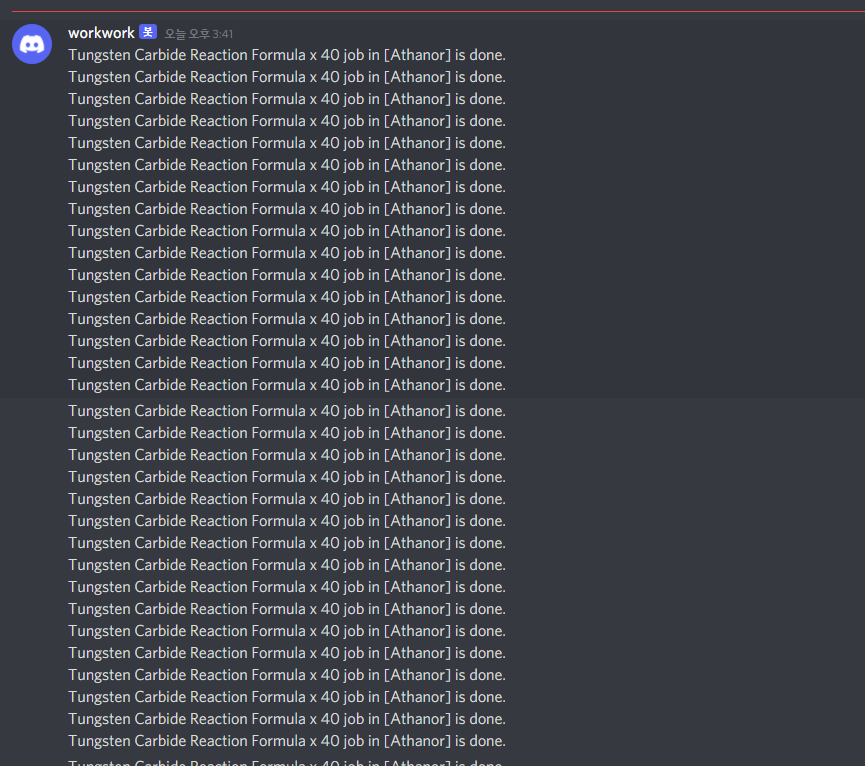

Eve Online corp industry notification tool

requirement
================
- eve-seat api: https://github.com/eveseat/seat
- discord_webhook: https://github.com/lovvskillz/python-discord-webhook
- crontab

params
===============
- eve_seat_api_token: eve seat api token
  - (http://[eve-seat host]/api-admin)
- eve_seat_host = eve-seat host
  - (example:http://192.168.0.2:8080/ or domain name)
- eve_corporation_id = eve corporation ID
  - check link in [eve-seat host]/corporations list
- redis_host = redis host
  - It should be coming with eve-seat
  - eve-seat use [0] index so this tool use [5] index
- discord_web_hook_url = discord chat channel web hook url

images
==================
